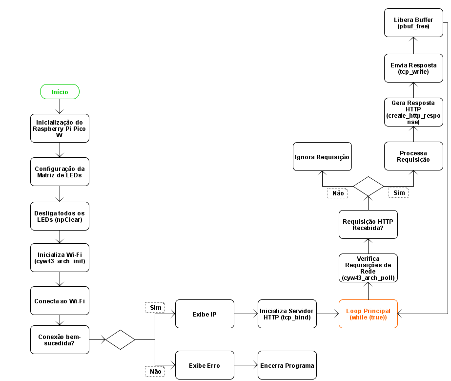

# Sistema de Controle Remoto de Matriz de LEDs 5x5 da BitDogLab via Interface Web com Raspberry Pi Pico W 🚀

Este projeto consiste em um sistema embarcado desenvolvido como requisito para a Atividade Final do curso de capacitação **EmbarcaTech**. O sistema permite o **controle remoto de uma matriz de LEDs 5x5** utilizando um **Raspberry Pi Pico W**. A interface de controle é acessível via **Wi-Fi**, por meio de uma página web intuitiva que possibilita **ligar, desligar e visualizar** o estado dos LEDs em tempo real.

Link para acessar o vídeo da explicação do código: [Clique aqui](https://drive.google.com/file/d/1-bGdaaGPfZlFNtaMzEG-4pJTlac0F1pY/view?usp=sharing).

---

## ⚙️ Estrutura do Projeto

O código foi estruturado em módulos para facilitar o entendimento. Abaixo estão os principais componentes:

1. **Conexões dos componentes da BitDogLab e Raspberry Pi Pico W**:

| **Componente**              | **Pinos** |
|-----------------------------|-----------|
| WS2812B (Matriz de LEDs)    | GPIO7     |
| Wi-Fi (CYW43 - Pico W)      | Interno   |
| Servidor HTTP               | -         |
| VCC (Matriz de LEDs)        | 3.3V      |
| GND (Matriz de LEDs)        | GND       |

2. **Controle dos LEDs**:
   - Utiliza o protocolo **WS2818B** para comunicação com a matriz de LEDs.
   - O controle é feito por meio de um programa escrito em **PIO (Programmable I/O)**.
   - As funções `npInit`, `npSetLED`, `npClear` e `npWrite` são responsáveis pela inicialização, configuração e atualização dos LEDs.

3. **Interface Web**:
   - Um **servidor HTTP** foi implementado utilizando a biblioteca `lwIP` para processar requisições e enviar respostas.
   - A página **HTML** é gerada dinamicamente, refletindo o estado atual da matriz de LEDs.
   - Requisições como `/led/x/y/on` alternam o estado de um LED específico, enquanto `/clear` desliga todos os LEDs.

4. **Conexão Wi-Fi**:
   - A conexão é estabelecida utilizando a biblioteca `cyw43`, que gerencia a interface Wi-Fi do **Raspberry Pi Pico W**.
   - As credenciais da rede (**SSID e senha**) são definidas no código.

5. **Loop Principal**:
   - O sistema fica em um **loop infinito**, onde o servidor HTTP processa requisições e o estado dos LEDs é atualizado conforme necessário.

---

## ⚙️ Como Executar o Projeto

### Pré-requisitos
- **Hardware**:
  - ✅ Raspberry Pi Pico W.
  - ✅ Matriz de LEDs **WS2818B 5x5**.
  - ✅ Conexão Wi-Fi disponível.
- **Software**:
  - ✅ Ambiente de desenvolvimento configurado para o Raspberry Pi Pico W (**SDK do Pico**).
  - ✅ Compilador compatível com C (**gcc**).

### Passos para Execução

1. **Configuração do Ambiente**:
   - Clone este repositório ou faça o download do código-fonte.
   - Certifique-se de que o **SDK do Raspberry Pi Pico W** está instalado e configurado corretamente.

2. **Modificação das Credenciais Wi-Fi**:
   - No arquivo `controle_remoto_matrizLED.c`, atualize as constantes `WIFI_SSID` e `WIFI_PASS` com as credenciais da sua rede Wi-Fi.

3. **Compilação e Upload**:
   - Compile o código utilizando a extensão do **Visual Studio Code** chamada [Raspberry Pi Pico Project](https://marketplace.visualstudio.com/items?itemName=raspberry-pi.raspberry-pi-pico).
   - Conecte a **BitDogLab** ao computador via USB e faça o upload do firmware gerado (arquivo `controle_remoto_matrizLED.uf2` dentro da pasta `build`).

4. **Acesso à Interface Web**:
   - Após a inicialização, o **Raspberry Pi Pico W** se conectará à rede Wi-Fi e exibirá o **endereço IP** no **monitor serial** (Serial Monitor) do **Visual Studio Code**.
   - Acesse o endereço **IP** no navegador para interagir com a interface web e controlar a **matriz de LEDs**.

5. **Controle dos LEDs**:
   - Na interface web, **clique** nas células da matriz para ligar ou desligar os LEDs correspondentes.
   - Utilize o botão **"Desligar os LEDs"** para desativar **todos os LEDs** de uma vez.

---

## ⚙️ Diagrama de Blocos da execução do Código

    

## ⚙️ Exemplo de Uso

1. Acesse a **interface web** no navegador.
2. Clique em uma **célula da matriz** para ligar o LED correspondente.
3. Observe a mudança no estado da **matriz de LEDs**.
4. Utilize o botão **"Desligar os LEDs"** para desativar todos os LEDs.

---

## Considerações Finais

O desenvolvimento deste projeto permitiu a criação de um sistema embarcado eficiente e interativo, capaz de controlar remotamente uma matriz de LEDs 5x5 por meio de uma interface web acessível via Wi-Fi. Através do conhecimento adquirido ao longo do curso de capacitação, utilizando o Raspberry Pi Pico W e a placa BitDogLab, foi possível desenvolver este sistema, destacando o potencial da tecnologia embarcada para inovações em diversas áreas e a importância do projeto EmbarcaTech, contribuindo para o aprendizado e a aplicação de conceitos avançados em eletrônica e programação.
